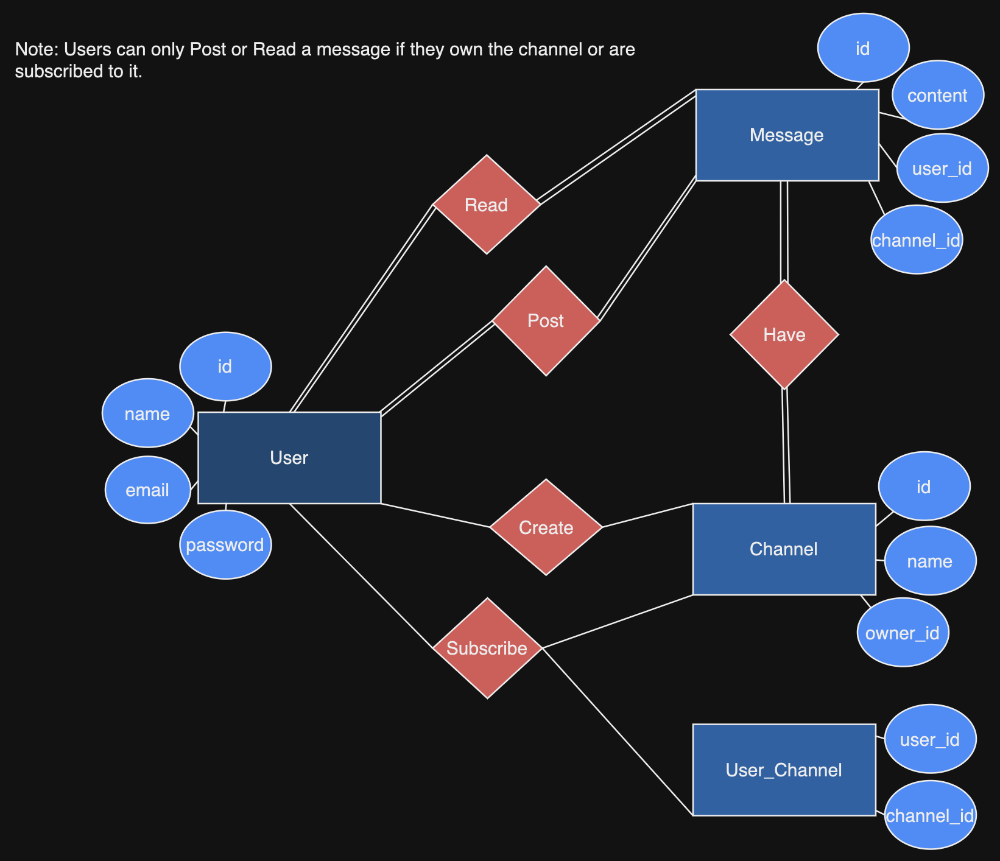

ER-Diagram

# SQL bulletin

## Instruktioner

Ni ska i denna gruppexamination bygga ett API för en tjänst som fungerar som en anslagstavla. En användare kan posta ett meddelande till en kanal som denna "prenumererar" på samt se andra meddelanden som finns i den kanalen. Tänk typ väldigt enkla Facebook grupper.

* En användare kan "prenumerera" på ingen eller flera olika kanaler.
* En användare kan posta ett meddelande till enbart en kanal. Kan dock bara posta ett meddelande till en kanal som användaren "prenumererar" på.
* En användare kan äga inga eller flera kanaler.
* Ett meddelande kan tillhöra enbart en kanal (**Ej VG**)
* Ett meddelande kan enbart komma från en användare.
* En kanal kan ha inga eller flera meddelanden.
* En kanal kan enbart ha en ägare.

Läs igen noga ovan och därför modellera upp databasen med dess entiteter och relationer i ett ER-diagram. Därefter bygg databasen och API:et.

**Hur noga ni vill vara med API:et får ni själva välja så länge det fungerar enligt kraven ovan. Exempelvis är det inget krav på att validera någon data från frontend eller använda sig av JSON Web token för att skapa en inloggningssession.**

## Betygskriterier

**För Godkänt:**
* Har ett komplett ER-diagram med alla entiteter och relationer som täcker in kraven ovan.
* Uppfyller all funktionalitet.
* bifoga exempelanrop till alla endpoints (se länk under inlämning)

**För Väl Godkänt:**
* Ett meddelande kan tillhöra en eller flera kanaler.
* Det går att sortera meddelanden på datum.

